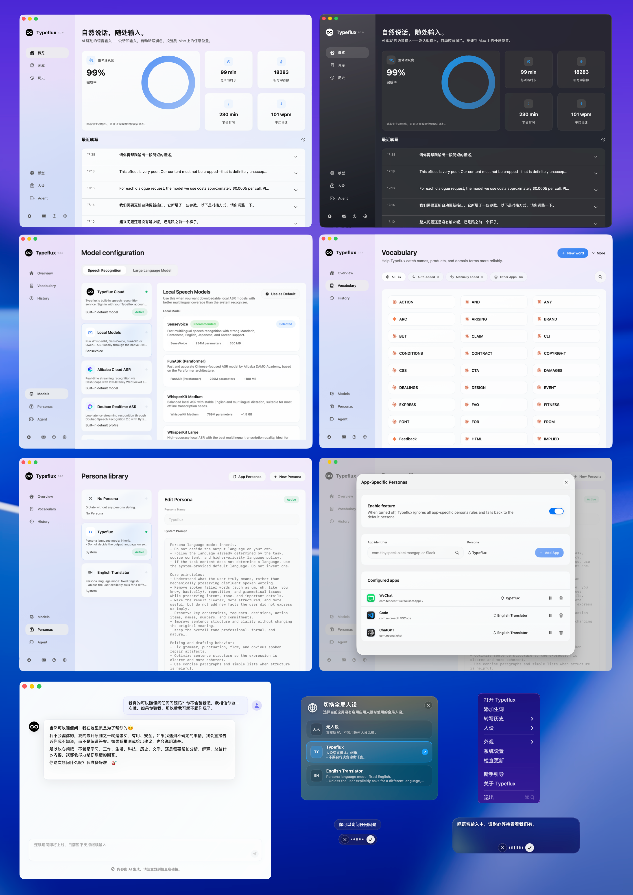

<div align="center">

# Typeflux - 你来说，我们来输入

按住 `Fn` 即可语音输入，双击 `Fn` 可以随口提问。Typeflux 会把快速、准确的语音转文字直接输入到任意 macOS 应用中。免费、开源，并支持本地模型 - 你的声音不必离开你的 Mac。

[](https://github.com/mylxsw/typeflux/actions/workflows/test.yml)
[](https://codecov.io/gh/mylxsw/typeflux)

[English](./README.md) | 简体中文

[](https://youtu.be/ZxWWUOEgaJ4)



[查看更多截图](./docs/SCREENSHOTS.md)

</div>

## 下载

**[⬇ 下载最新版本 (.dmg)](https://github.com/mylxsw/typeflux/releases/latest)**

1. 从最新 Release 下载 `Typeflux.dmg`
2. 打开 DMG，把 `Typeflux.app` 拖到 **Applications**
3. 启动应用，并授予麦克风和辅助功能权限

> **macOS 13+** · 免费 · 无订阅 · 支持完全本地推理

## 为什么选择 Typeflux

大多数语音输入工具都会迫使你切换应用 - 先在一个地方听写，再复制粘贴到另一个地方。这样的上下文切换会打断心流。

Typeflux 会在你松开快捷键的那一刻，把文本直接注入到当前正在使用的应用和光标位置。它感觉就像打字，只是速度快了 **4 倍**（约 200 WPM vs. 约 50 WPM）。

当你需要的不只是听写时，**Ask Anything** 可以把你的声音变成 AI 助手，用于问答、改写、翻译和复杂工作流。

## 工作方式

```
按住 Fn → 说话 → 松开 → 文本立即出现
Fn ×2 → 提问 → 松开 → 回答、编辑或执行操作
```

1. **按住** `Fn`（默认快捷键）
2. **自然说话**
3. **松开** - Typeflux 会转写语音，并把文本注入到你的光标位置
4. **双击** `Fn` 使用 Ask Anything，完成问答、选中文本编辑和 Agent 工作流
5. 结果也会复制到剪贴板，作为备用方案

## 功能

### 一键语音输入

按住 `Fn` 开始，松开停止。不需要切换输入法，也不需要点击按钮 - 可在浏览器、代码编辑器、终端和原生应用里的任意文本框使用。

### Ask Anything (`Fn` ×2)

它不只是听写。双击 `Fn`，在第二次按下时说话，然后松开，即可用语音和 AI Agent 对话：

- **语音问答** - 提问并立即获得回答
- **内容改写** - 选中文本，然后说出类似“缩短一点”或“翻译成英文”的指令
- **复杂工作流** - 通过自然对话处理多步骤任务

### 本地优先，隐私优先

可以完全在你的 Mac 上通过端侧模型运行。不需要 API Key，数据也不会离开你的设备。我们不会收集、存储或分析你的任何语音或文本数据。

### 自定义人格

为不同场景创建命名指令集 - 工作邮件、学习笔记、日常聊天、代码注释 - 并可从菜单栏随时切换。

### 多种语音识别后端

| 提供方 | 类型 | 适合场景 |
|----------|------|----------|
| Typeflux Cloud | 云端 | 零配置，准确率均衡 |
| Local Model | 本地 | 隐私保护，离线使用 |
| Alibaba Cloud ASR | 云端流式 | 低延迟，中文 |
| Doubao Realtime ASR | 云端流式 | 中文优化 |
| Google Speech-to-Text | 云端 | 多语言，企业场景 |
| OpenAI (Whisper API) | 云端 | 高准确率 |
| Multimodal LLM | 云端 | 视觉 + 音频任务 |
| Groq | 云端 | 快速推理，低成本 |
| Free Models | 云端 | 无需 API Key，开源端点 |

### 本地模型

当你选择 **Local Model** 时，Typeflux 会下载模型并完全在你的 Mac 上运行：

| 模型 | 大小 | 参数量 | 适合场景 |
|-------|------|--------|----------|
| SenseVoice | ~350 MB | 234M | 快速多语言，擅长普通话、粤语、英语、日语、韩语 |
| FunASR (Paraformer) | ~180 MB | 220M | 快速、准确、偏中文的离线 ASR |
| WhisperKit Medium | ~1.5 GB | 769M | 均衡的英语和多语言听写 |
| WhisperKit Large | ~3 GB | 1.55B | 最高准确率的离线转写 |
| Qwen3-ASR | ~1.3 GB | 0.6B | 强上下文理解，长文本识别 |

### 流式预览

说话时就能看到部分转写结果，在松开前获得即时反馈。

### 历史与重试

每次会话都会保存在本地。你可以查看历史记录、回放音频、使用不同设置重新转写，或把记录导出为 Markdown。

## 系统要求

- macOS 13 或更高版本
- 麦克风权限
- 辅助功能权限（用于文本注入）

使用云端提供方时：需要 API Key 和端点 URL。  
使用本地推理时：模型文件会在首次使用时自动下载。

## 从源码构建

```bash
git clone https://github.com/mylxsw/typeflux
cd typeflux

# 一次性设置：创建本地代码签名身份，让 macOS
# 权限（麦克风、辅助功能）在多次重建后保持稳定。
scripts/setup_dev_cert.sh

make run          # 构建并以 .app bundle 形式启动
make dev          # 启动并附带终端日志
make full-dev     # 使用内置 SenseVoice 资源启动开发应用
make full-release # 在本地构建完整的已公证生产安装包
make release-continue # 继续中断的本地发布流程
swift test        # 运行测试
```

> ⚠️ 如果跳过 `setup_dev_cert.sh`，`make run` 仍然可用，但 macOS 会在每次构建后重新请求权限（ad-hoc 签名）。

完整开发指南请参阅 [CLAUDE.md](./CLAUDE.md)。

## 文档

- [使用指南](./docs/USAGE.md)
- [Make 命令](./docs/MAKE_COMMANDS.md)
- [发布指南](./docs/RELEASE.md)
- [更新日志](./CHANGELOG.md)

## 社区

加入社区，分享反馈、提问，并关注开发动态：

- [加入 Discord](https://discord.com/invite/Vr5389YrN)
- [X](https://x.com/mylxsw)
- 微信群：

  

## 贡献

Typeflux 是一个完全开源的项目。我们相信优秀工具应该属于每一个人。

欢迎贡献 - STT 提供方集成、悬浮层体验、设置页面、文本注入边界情况、历史/导出功能，都是很好的切入点。

1. 阅读 [CLAUDE.md](./CLAUDE.md) 中的模块布局
2. 使用 `make dev` 在本地运行应用
3. 为任何逻辑变更添加或更新测试
4. 提交 PR，并说明对用户可见的影响

## 许可证

AGPL-3.0。详见 [LICENSE](./LICENSE)。
